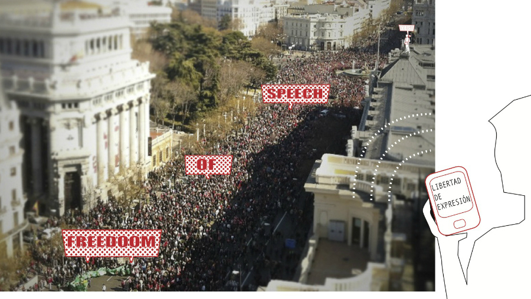
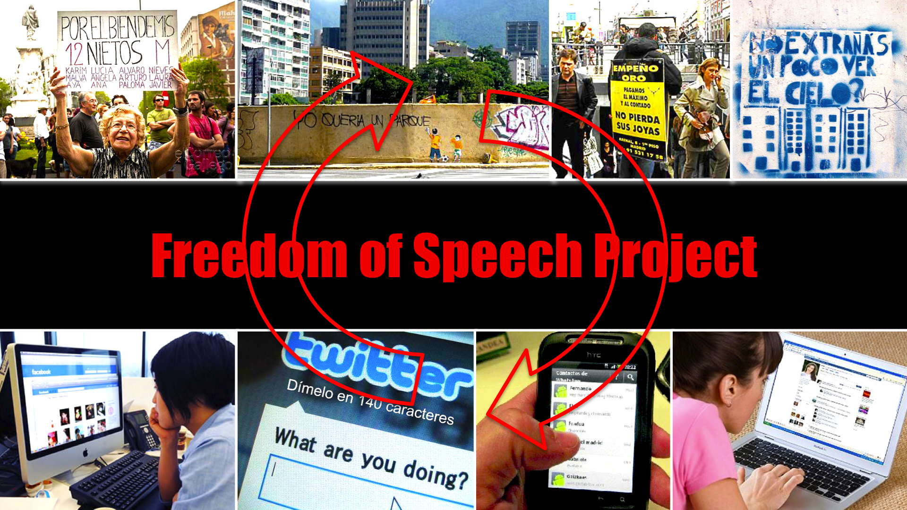

# Project Title
Kit de Libertad de Expresión / Freedom of Speech Kit

## Authors
- Anna Carreras www.github.com/acarreras
- Chema Blanco
- Maria Solé Bravo

## Description
The "Kit de Libertad de Expresión (KLE)" is  an interactive and portable banner where people can send a message to express their claims during social demonstrations.
Outdoor collective demonstrations have been recently organized through social networks where people act as single entities (from their computers, mobile phones,...). The "Kit de Libertad de Expresión" it's an evolved banner, a social placard which reduces the gap between the individuality using social networks to protest and the collective expression of ideas in a demonstration.

## Images & Videos

